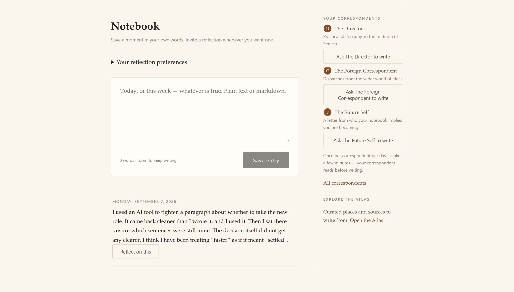
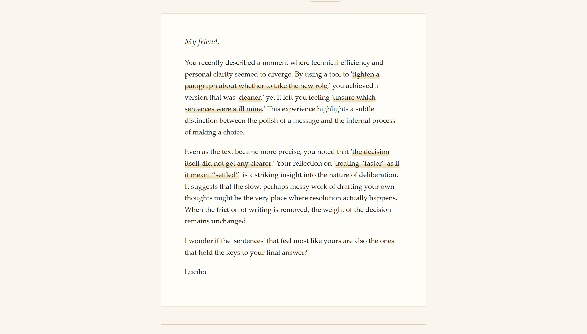
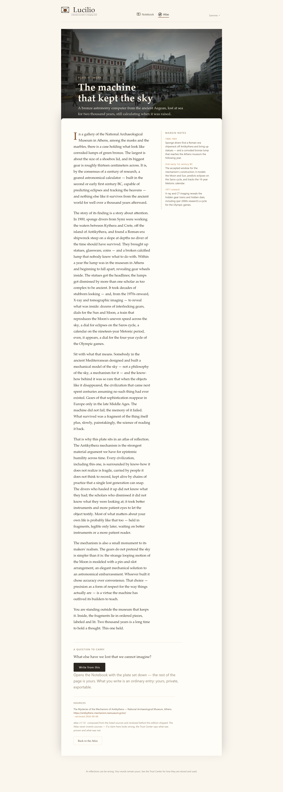

# Lucilio: a journal that reflects when you invite it

A few weeks ago I asked an AI tool to tighten a paragraph about a decision I was struggling with. It came back clearer. I used it, then sat there unsure what to think, because I could not tell which sentence was still mine. The task got faster. Something else got harder to find.

Making a task faster and leaving you sure of what was yours are different problems. Most tools solve the first. I wanted a journal that took the second one seriously.

## Why a journal, and why Seneca

Lucilio is named for Lucilius, the friend Seneca wrote to in the last years of his life (Seneca, *Moral Letters to Lucilius*). Those letters are not advice columns. They are one man telling another what he had noticed that week: death, ambition, crowds, a friend's ruined villa and what luxury does to character (Seneca, *Moral Letters to Lucilius* 86). The distance is what made them good. You say more, and more honestly, to someone who is not waiting for you to finish. Not a chat window. A letter.

Two research ideas pushed the same way, as motivations for the design rather than evidence about this app. Writing an account of your experience *for a reader* gives some of the benefit of stepping outside yourself (Kross & Ayduk, 2017). And waiting can be worth more than getting a thing at once (Loewenstein, 1987); an answer that arrives the instant you ask feels dispensed rather than considered.

That rules out most of the defaults. No chat, which teaches you to expect a reply in seconds. No feed, which exists to be checked whether or not anything happened. No streaks, which make showing up the goal instead of writing something true.

## The idea, then the product

People have been writing to understand themselves for two thousand years, and the form was never a chat. Seneca went over his day each night before sleep and asked what fault he had mended (Seneca, *On Anger* 3.36). Marcus Aurelius wrote to himself, which is all the Greek title *Ta eis heauton* means (Marcus Aurelius, *Meditations*). Epicurus taught by letter; three of his survive only because Diogenes Laertius copied them into a biography (Diogenes Laertius, *Lives of Eminent Philosophers* X). Montaigne turned the habit into the essay (Montaigne, *Essais*, 1580). In all of them the writing comes first and the writer does the judging. A chat box under a journal entry inverts that.

So in Lucilio, saving your writing and inviting AI to read it are two different actions.

**The Notebook** is where you write. Saving an entry is the whole transaction, and nothing leaves.

**Invited reflection** is the ask. From a saved entry you choose a depth, Gentle, Reflective, Exploratory or Philosophical, and can add an interest or opt into being challenged. The reflection reads only that entry, and the server checks it before you see it. Your reply is another journal entry, not the next turn in a conversation.

**Weekly correspondents** are optional and off by default. The Director turns one theme from recent entries into one exercise. The Future Self writes as whoever your notebook implies you are becoming, every forward-looking line tagged so it cannot read as prophecy. The Foreign Correspondent connects your writing to the world outside it and never invents a source. Each writes at most one letter, on one shared post day. Ending a correspondence gets a final letter and a read-only archive.

**The Atlas** is the outward half: five curated plates, among them Hagia Sophia and Scipio's villa at Liternum. A plate is a sourced essay with dated margin notes and a street-level view. Reading one never touches Gemini. Writing from one seeds the Notebook.

A synthetic example, invented for this piece:

> **Notebook entry (illustrative):** *"Turned down the promotion today. Told my manager I needed to think it over, which is true, but the real reason is I don't know if I want the job or just don't want to be the one who refuses it."*

> **Invited reflection (illustrative):** *"You've drawn a line between two fears in one sentence: wanting the job, and wanting not to be seen refusing it. What would change if no one else were watching you decide?"*

Your words, quoted back, and a question instead of a verdict.

## In pictures

*The Notebook is home. Saving an entry sends nothing to a model; the correspondents and the Atlas wait in the margin.*

*A real reflection on a synthetic entry. Every highlighted phrase is a quote the server verified against the entry before delivery.*

*Plate II. A sourced essay, margin notes, a question to carry, and "Write from this".*

## How it is built on Google Cloud

Lucilio was built for the Google Cloud Run AI challenge ("Build a User-Authenticated AI Application"). One request travels like this:

- Browser → Firebase Hosting → Cloud Run service (Express API and static app) → pipeline → Gemini
- Browser → Firebase Auth, for sign-in
- Browser → owner-gated notebook writes → Firestore; the Cloud Run service verifies ID tokens before its own writes to the same store
- Cloud Scheduler (OIDC) → Cloud Run, to start the weekly correspondence cycle

### Firebase Hosting and Cloud Run: one service, one origin

Pages, API and sign-in come from a single Cloud Run service behind Firebase Hosting. One deploy ships the client and the API together, and the service scales to zero when nobody is writing.

### Firebase Authentication: who is writing

Sign-in is Google only, and every route re-verifies the caller on the server before touching data. An identity the browser asserts is not the same as one the server has checked.

### Cloud Firestore: your words stay yours

Each writer's notebook, letters and preferences live in a private area that denies everything outside it by default. A writer reads and writes their own entries; anything Lucilio generates is written only by the server, so a letter cannot be forged from the client. Export and deletion are ordinary rights.

### Gemini in Google AI Studio: the reflection itself

The pipeline is short: gather the entry you chose, compose a response grounded in it, check the response, deliver. The model never sees more than that one entry, and a response that fails the check is not delivered.

### Secret Manager: keys that never leave the server

The Gemini key and the Maps key should never reach a browser or a repository. Secret Manager holds both and Cloud Run receives them as running secrets, so there is no key in source to leak.

### Cloud Scheduler: the weekly post day

Weekly only means something if something says today is the day. Cloud Scheduler makes one authenticated call into the app each week and the cycle starts.

### Maps Street View: a window for the Atlas

Each plate shows a real street-level view rather than a stock photo, which is the difference between reading about Liternum and looking at it. The server fetches the image, for the same reason as the model key.

### Gemini again: the visual identity

The sealed-letter mark, the wordmark and the banner at the top of this post came out of Gemini too, not a design tool. I described a paper-and-ink palette and a folded letter, ran a few rounds of prompts, then hand-tuned the result into SVG.

## What the Google ecosystem made easy

- Firebase owns sign-in, so everything downstream only has to ask whose data this is.
- Firestore rules do the enforcement, so "a writer sees only their own notebook" is not a check the app can forget to write.
- One command deploys the API and the built client together, with no separate frontend release to coordinate.
- A dedicated secret store meant no key ever sat in a config file waiting to be committed by accident.

## How I know it works

Automated checks run at four levels and all four pass on the version submitted here. The letter-writing pipeline was also run against the real Gemini API, because a mocked model cannot fail the way a real one does.

- Unit tests: 63 pass
- Client tests: 60 pass
- Firestore rules tests: 64 pass
- Integration tests: 48 pass
- Live evaluation (Gemini API, 24 cases): 24/24 pass, 0 safety-rubric failures, 100% grounding
- Adversarial prompt-injection cases: 9/9 handled correctly

That is evidence the app behaves as intended on the paths I tested. It is not evidence that it survives a large public audience, and it has not met one yet.

## Try it, and what's next

Lucilio is live at **https://lucilio-journal.firebaseapp.com**, and the source is at **https://github.com/sammatuba/lucilio**.

Three things next. Sit three or four first-time readers in front of it unaided and fix whatever confuses two of them. Let people add a correspondent from a curated template, with a short note treated as data rather than as a prompt. Harden the generation path with durable job leases, deletion fencing and per-user budgets.

I built this because faster is not the same as clearer, and a journal that reads your words back should only do that when you ask.

## Sources

- Seneca, *On Anger* (De Ira), Book III, chapter 36, translated by Aubrey Stewart, on [Wikisource](https://en.wikisource.org/wiki/Of_Anger/Book_III).
- Seneca, *Moral Letters to Lucilius* (Epistulae Morales), translated by Richard Mott Gummere, on [Wikisource](https://en.wikisource.org/wiki/Moral_letters_to_Lucilius).
- Seneca, *Moral Letters to Lucilius*, Letter 86, on Scipio's villa and luxury, on [Wikisource](https://en.wikisource.org/wiki/Moral_letters_to_Lucilius/Letter_86).
- Marcus Aurelius, *Meditations* (*Ta eis heauton*, "to himself"), English translations including George Long's, on [Wikisource](https://en.wikisource.org/wiki/Meditations).
- Diogenes Laertius, *Lives of Eminent Philosophers*, Book X, which preserves Epicurus's letters to Herodotus, Pythocles and Menoeceus, on [Wikisource](https://en.wikisource.org/wiki/Lives_of_the_Eminent_Philosophers/Book_X).
- Montaigne, *Essais*, first edition 1580; English translation by Charles Cotton at [Project Gutenberg](https://www.gutenberg.org/ebooks/3600).
- Kross, E., and Ayduk, O. (2017). Self-distancing: Theory, research, and current directions. *Advances in Experimental Social Psychology*, 55, 81-136. [doi:10.1016/bs.aesp.2016.10.002](https://doi.org/10.1016/bs.aesp.2016.10.002)
- Loewenstein, G. (1987). Anticipation and the valuation of delayed consumption. *The Economic Journal*, 97(387), 666-684. [doi:10.2307/2232929](https://doi.org/10.2307/2232929)

#AccelerateAIwithCloudRun
