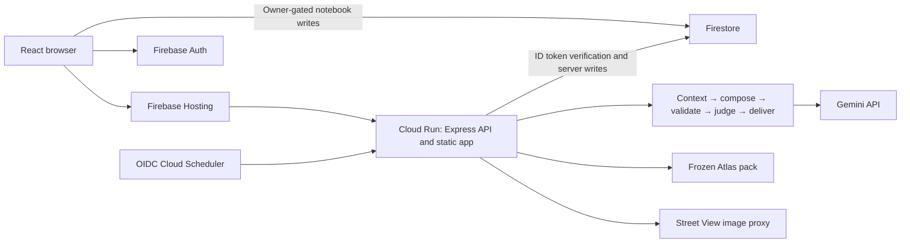
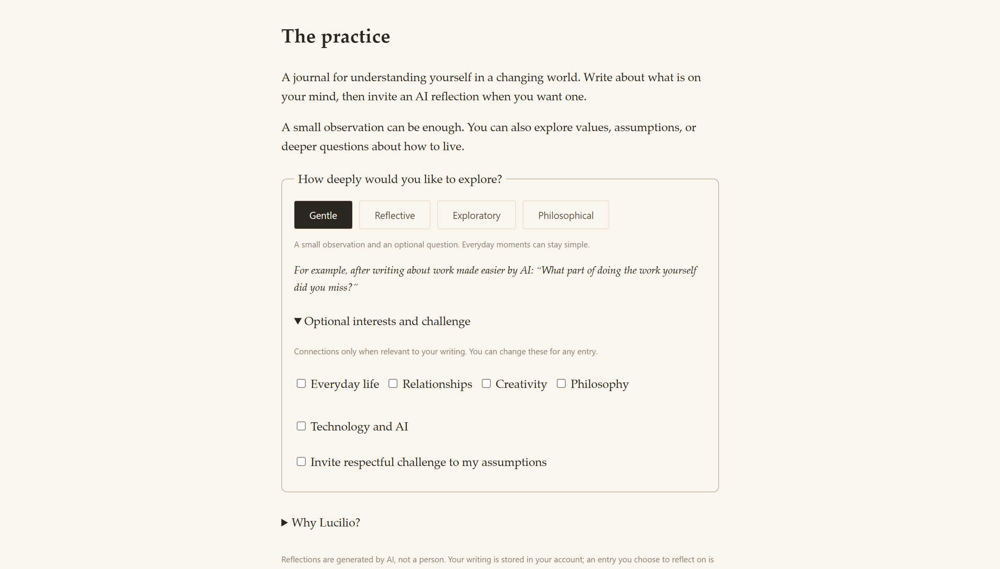
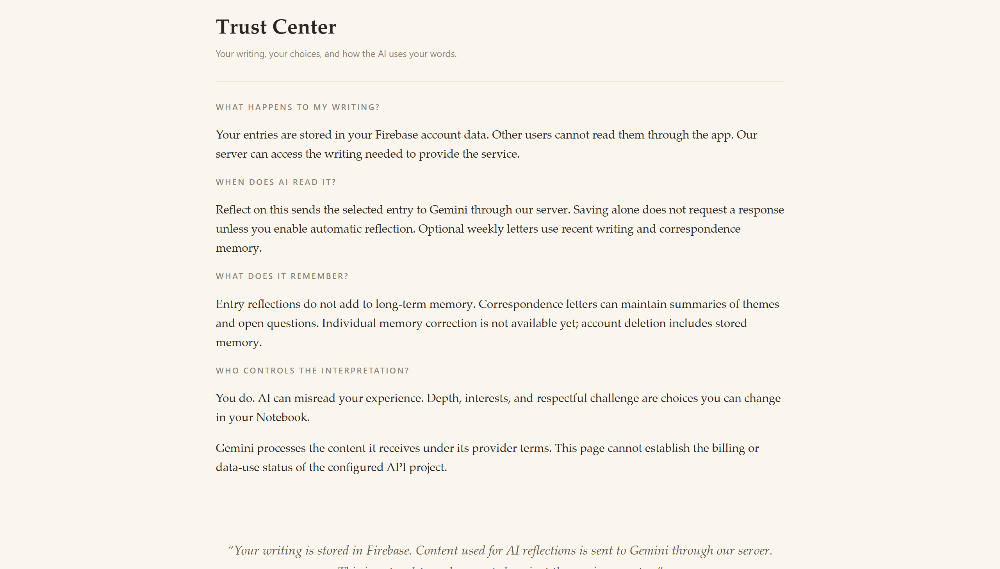
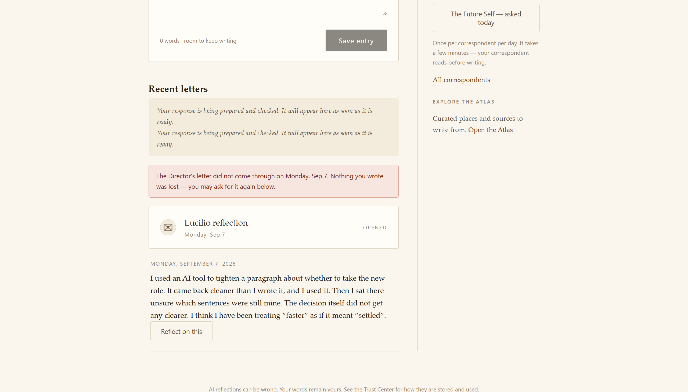
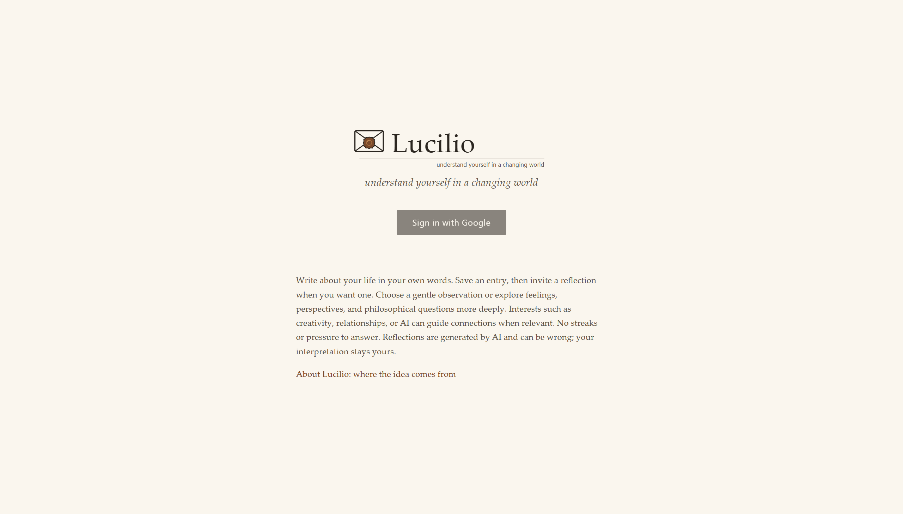

# Lucilio: a journal that reflects when you invite it

A few weeks ago I asked an AI tool to tighten a paragraph I'd written about a decision I was struggling with. It came back better: clearer, better ordered, a little wiser-sounding than my draft. I used it, then sat there unsure what to think, because the paragraph was good now but I couldn't point to which sentence was still mine. The task got faster. Something else got harder to find.

AI is very good at making a task go faster. It is not automatically good at leaving you sure of what was yours. Those are different problems, and most tools solve only the first one. I wanted a journal that solved the second on purpose.

## Why a journal, and why Seneca

Lucilio takes its name from Lucilius, the friend Seneca wrote to over the last years of his life. The Letters to Lucilius aren't advice columns or therapy. They're one person writing to another, at a distance, about what they'd noticed that week: death, ambition, crowds, a friend's ruined old villa and what luxury does to character. The distance was the point: you say more, and more honestly, in a letter than in a conversation where the other person waits for you to finish your sentence. That's the shape I wanted for a reflective practice with AI. Not a chat window. A letter.

Two ideas shaped that choice, and both are design motivations here, not measured outcomes of this app. Research on self-distancing (associated with Ethan Kross) suggests composing an account of your own experience *for a reader*, rather than replaying it in your head, gives some of the benefit of stepping outside yourself, reflection without the loop of rumination. Research on anticipation suggests waiting for a good thing can be worth more than getting it instantly; a response arriving the moment you ask feels dispensed rather than considered. That's why weekly correspondence, where used at all, sits on one shared post day instead of arriving whenever.

Both point the same way: don't make this fast, and don't make it always-on. No chat, which trains you to expect an instant reply. No feed, which exists to be revisited whether or not there's anything new. No streaks, which make showing up the goal instead of writing something true. A practice like this has to survive a week unused without punishing you for it.

The look of the app follows the same idea. The sealed-letter mark, the wordmark, and the banner above were generated with Gemini in Google AI Studio, from prompts matched to the app's paper-and-ink palette, then hand-tuned into SVG for the interface. More on that further down.

## The idea, then the product

Before the surfaces, the difference. People have written to understand themselves for a very long time, and the form was never a chat. Seneca advised a nightly review of the day, asking what fault was mended and what remained. Marcus Aurelius wrote the Meditations to himself, in a notebook never meant for readers. Epicurus and Seneca taught through letters, because a letter makes you set your thoughts in order for someone who is not in the room. Montaigne turned the practice into the essay. In every case the writing came first, the judgment came later, and the person doing the judging was the writer. A chat box under a journal entry gets that wrong: it answers before you have finished thinking, from outside your own words, and it never has to wait. Lucilio keeps the old shape and gives it a modern correspondent. Saving is not a prompt. You set the depth and whether challenge is welcome. Every reflection must quote your own words, checked by the server, and pass a second safety review. There is no chat, no feed, no streaks, no notifications. Letters come on a post day and can be ended on purpose. The Atlas turns the practice outward, as the Stoics did with their examples from the wider world. And your data can be exported or deleted in full, with a Trust Center that shows the evidence instead of promising it.

*The Notebook is home. Saving an entry sends nothing to a model; the correspondents and the Atlas wait in the margin.*

The idea is simple: a journal where saving your writing and inviting AI to read it are two separate actions, and where you decide how deep the response goes.

**The Notebook** is where you write, with no AI in the loop by default. You write an entry, you save it, and saving is the whole transaction, nothing is sent anywhere unless you ask.

**Invited reflection** is the ask. From a saved entry, you request a response at one of four depths, Gentle, Reflective, Exploratory, or Philosophical, optionally adding an interest and opting into being challenged rather than simply validated; philosophical depth isn't automatically confrontation. The reflection reads only the entry you selected, composes a response grounded in what you actually wrote, and gets checked before it's shown to you. Your reply, if you write one, becomes an ordinary journal entry, not the next turn in a conversation.

**Weekly correspondents** are optional and off by default. There are three: the Director, pulling one theme from recent entries into one concrete exercise, in the tradition of practical philosophy; the Future Self, writing from who your notebook implies you're becoming, every forward-looking line tagged so it never reads as prophecy; and the Foreign Correspondent, connecting your writing to the wider world in two or three grounded connections, sources never invented. Each writes at most one letter on a shared post day. Concluding a correspondence gets one final letter and a bound, read-only archive volume: a designed ending, not an abandonment.

**The Atlas** is the outward half of the practice: five curated plates, Hagia Sophia, an Atacameño astronomy village, Scipio's villa at Liternum (by way of Seneca's actual Letter 86), and others, each with a sourced essay, dated margin notes, sources, and a Street View vantage fetched through the server. Every plate ends with an optional prompt and a "Write from this" button that seeds the Notebook. Reading a plate never touches Gemini; only writing from it, in your own words, can reach the correspondence loop.

A synthetic example, invented for this piece, of what that looks like end to end:

> **Notebook entry (illustrative, not real output):** *"Turned down the promotion today. Told my manager I needed to think it over, which is true, but the real reason is I don't know if I want the job or just don't want to be the one who says no to it."*
>
> **Invited reflection, Reflective depth (illustrative, not real output):** *"You've drawn a line between two fears in one sentence without quite noticing: wanting the job, and wanting not to be seen refusing it. What would change here if no one else were watching you decide?"*

*A real reflection on a synthetic entry. Every highlighted phrase is a quote the server verified against the entry before delivery.*

That's the whole shape: your words, read back with something specific in them quoted, and one question instead of a verdict.

## How it is built on Google Cloud

Lucilio is built for the Google Cloud Run AI challenge ("Build a User-Authenticated AI Application"). Rather than list the pieces, follow one request as it moves through the app: you sign in, you write, the app stores what you wrote, and only if you ask does it reach a model.

<!-- Medium may not render inline SVG; swap for a PNG export of the lockup when publishing there. -->

### Firebase Hosting and Cloud Run: one service, one origin

Everything the browser talks to, pages, API, sign-in, comes from one Cloud Run service fronted by Firebase Hosting. One deploy updates the client and the API together, and Cloud Run scales to zero when idle. Keeping everything on one origin is also what lets sign-in work cleanly, the next stop on this path.

### Firebase Authentication: who is writing

*Depth is a choice made before any model is involved: Gentle, Reflective, Exploratory, or Philosophical.*

Before anything is stored or generated, the app needs to know who's asking. Sign-in is Google only, and every API route checks the signed-in identity on the server before touching a user's data. Without a verified writer behind each request, there's no way to say an entry belongs to one person and no one else, so the app trusts nothing until Firebase's handshake is confirmed on the server, on every request.

### Cloud Firestore: your words stay yours

*The Trust Center answers the questions people actually ask: what happens to my writing, when does AI read it, what does it remember.*

Your writing has to live somewhere, separated from everyone else's. Firestore holds each writer's notebook, letters, and preferences in their own private area, denying access to anything outside it by default. A writer reads and writes their own entries directly; anything Lucilio itself generates, like a letter, is written only by the server, so it can't be forged. Export and full account deletion are built in as ordinary rights, not extras.

### Gemini in Google AI Studio: the reflection itself

*Letters are prepared and checked before they appear. When a model call fails, the tray says so and offers to ask again; nothing written is lost.*

This is the part that reads your words back to you, only when you ask. A request for a reflection goes through a short pipeline: gather the entry you chose, compose a response grounded in it, check that response before showing it to you. The model never sees more than the entry you selected, and a response that fails its own check isn't delivered: read only what you're given, and quote it honestly.

### Secret Manager: keys that never leave the server

The app needs a key to call Gemini and a key to call Google Maps, and neither should end up somewhere a browser or a repository could see it. Secret Manager holds both, and Cloud Run receives them only as running secrets, never as files in source, so there's no key to paste into client code by mistake.

### Cloud Scheduler: the weekly post day

The optional weekly correspondents all write on one shared day, and something has to say "today is that day." Cloud Scheduler makes one authenticated call into the app on a weekly cadence to start that cycle, turning "weekly" into something that happens without a person remembering to trigger it.

### Maps Street View: a window for the Atlas

*Plate II. A sourced essay, margin notes, a question to carry, and "Write from this".*

The Atlas pairs each curated place with a real street-level image rather than a stock photo, so Liternum or Hagia Sophia feels like somewhere real. The app fetches that imagery server-side and hands the finished image to the browser, for the same reason as the model key above: fewer places a key lives, fewer ways it can leak.

### Gemini again: the visual identity

*The lockup on the landing page, generated with Gemini and tuned into SVG.*

The sealed-letter mark, the wordmark, and the banner at the top of this post also came from Gemini in Google AI Studio, not a design tool. I described the palette, the paper-and-ink feel, and the idea of a folded letter, worked through a few rounds of prompts until one felt right, then hand-tuned the result into SVG so it would render crisply in the app itself. It's the same model that writes the reflections, pointed at a different kind of output.

## What the Google ecosystem made easy

A few things came together with less friction than I expected, because the pieces are built to hand off to each other:

- Sign-in was mostly Firebase's problem, not mine: once it trusts a verified identity, everything downstream can just ask "whose data is this."
- Firestore's rules do the enforcement, so "a writer only sees their own notebook" isn't something the app has to re-check in code.
- Deploying is one command to Cloud Run, updating the API and the built client together, with no separate frontend release to coordinate.
- A dedicated secret store meant the model and maps keys never had to touch a config file that might get committed by accident.
- Calling the model itself is just an API key and a request, keeping the AI plumbing small next to everything around it.

## How I know it works

The app has automated checks at four levels: core logic, client interface, database access rules, and end-to-end integration. All four pass on the version submitted here. Separately, the letter-writing pipeline was run earlier against the real Gemini API in a live evaluation, not a mocked one, to see how it performed on actual model output.

| Check | Result |
|---|---|
| Unit tests | 63 pass |
| Client tests | 60 pass |
| Firestore rules tests | 64 pass |
| Integration tests | 48 pass |
| Live evaluation (Gemini API, 24 cases) | 24/24 pass, 0 safety-rubric failures, 100% grounding |
| Adversarial prompt-injection cases | 9/9 handled correctly |

That's reasonable evidence the app behaves as intended on the paths I tested. It is not the same as having been used or attacked by a large public audience, and I'm not claiming it has: this is a careful demo, not yet hardened for that scale.

## Try it, and what's next

Lucilio is live at **https://lucilio-journal.firebaseapp.com**, and the source is at **https://github.com/sammatuba/lucilio**.

Three things I'd want to do next: sit three or four first-time readers in front of it unaided and fix whatever confuses them twice; let people add a correspondent from a curated template with a short, bounded note about what they want, treated as data rather than as a prompt; and harden the generation path with durable job leases, deletion fencing, and shared per-user budgets before calling it ready for public scale.

I built this because faster isn't the same as clearer, and a journal that reads your words back should only do that when you ask.

#AccelerateAIwithCloudRun
